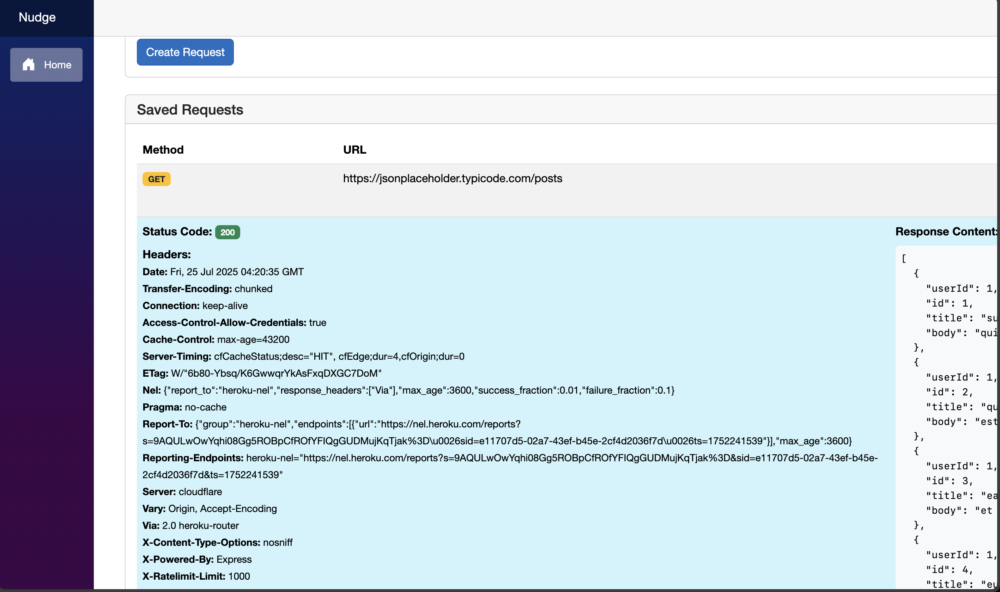

# Nudge

> **Minimal API client.** A clean, cross-platform request tester built with **Blazor WebAssembly** and **ASP.NET Core**.

## Table of Contents

1. [Features](#features)
2. [Live Demo](#live-demo)
3. [Screenshots](#screenshots)
4. [Tech Stack](#tech-stack)
5. [Repository Structure](#repository-structure)
6. [Getting Started](#getting-started)
7. [Code Style & Practices](#code-style--practices)
8. [License](#license)

---

## Features

| Status | Feature                                           |
|--------|---------------------------------------------------|
| ✅     | **Compose requests:** Set method, URL, and body    |
| ✅     | **Displays response:** Status, headers, content    |
| ✅     | **Shared Library:** DTOs and Models in `Nudge.Lib` |
| ✅     | **Responsive layout:** Mobile and desktop support  |

---

## Live Demo

> 🔗 [nudge-client.azurewebsites.net](https://nudge-client.azurewebsites.net)

---

## Screenshots

<details>
  <summary><em><strong>Click to view screenshots</strong></em></summary>

  
  
  
  

</details>

---

## Tech Stack

| Layer         | Technology                          |
|---------------|-------------------------------------|
| Client        | Blazor WebAssembly (.NET 9)         |
| Server        | ASP.NET Core Web API (Controllers/) |
| Shared Models | .NET Class Library (`Nudge.Lib`)    |
| Hosting       | Azure App Service                   |

---

## Repository Structure

```
Nudge/
├── Nudge.Client/                # Blazor WASM frontend
│   ├── Pages/                  # Main Razor pages (e.g. Home.razor)
│   ├── Services/               # HttpClient logic (ApiService)
│   ├── Shared/                 # Shared UI components (e.g. NewRequest)
│   ├── Program.cs              # WASM bootstrapping
│   └── wwwroot/                # Static assets & settings

├── Nudge/                       # ASP.NET Core backend
│   ├── Controllers/            # API proxy logic (RequestManagerController)
│   ├── Repositories/           # Repository Interfaces and Implementations (IRequestRepository, Dapper-based Implementation)
│   ├── Components/             # Razor layout & routing (App.razor etc.)
│   └── Program.cs              # API startup & configuration

├── Nudge.Lib/                  # Shared DTOs and models
│   ├── Dtos/                   # Request/response contract classes
│   ├── Models/                 # Domain-level models
│   └── Nudge.Lib.csproj

├── Screenshots/               # UI images for README
├── Nudge.sln                  # Solution file
└── README.md
```

---

## Getting Started

### Prerequisites

* [.NET 9 SDK]
* Git

### Local Development

```bash
# 1. Clone the repository
$ git clone https://github.com/abhinav-0401/Nudge.git
$ cd Nudge


$ dotnet user-secrets init
# sets the Azure DB connection string in user directory
$ dotnet user-secrets set "AzureSqlNudge" "DB_CONNECTION_STRING"

# (runs the project on localhost:5014)
$ dotnet run --project Nudge
```

---

## Code Style & Practices

* **C#**: Follow the Microsoft C# style guide.
* Shared contracts are declared in `Nudge.Lib` to avoid duplication
* Backend uses `Dapper` for lightweight DB operations
* Razor component logic is co-located with markup
* Separation of layers:
  - **Frontend** (`Nudge.Client`)
  - **Backend** (`Nudge`)
  - **Shared library** (`Nudge.Lib`)

---

## License

This project is licensed under the **MIT License**.

---